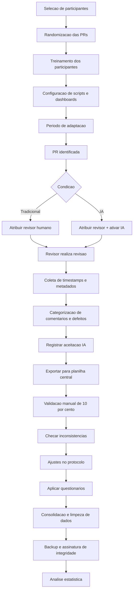

# Plano de Experimento – Scoping e Planejamento

## 1. Identificação Básica

### 1.1 Título do experimento
**Avaliação da Efetividade da Revisão de Código Assistida por IA em Comparação com Revisão Humana Tradicional**

### 1.2 ID / código
**EXP-REV-IA-2025**

### 1.3 Versão do documento e histórico de revisão
- **v1.0 (19/11/2025)** — Criação inicial do plano.
- **v1.1 (22/11/2025)** — Inclusão completa do escopo, GQM, métricas, riscos e critérios.

### 1.4 Datas (criação, última atualização)
- **Criação:** 19/11/2025  
- **Última atualização:** 22/11/2025

### 1.5 Autores (nome, área, contato)
- **Maisa Pires** — Engenharia de Software — maisa.andrade@sga.pucminas.br

### 1.6 Responsável principal (PI / dono do experimento)
**Maisa Pires (Engenharia de Software)**

### 1.7 Projeto / produto / iniciativa relacionada
**Iniciativa de Melhoria de Qualidade de Código e Produtividade de Revisões do time de desenvolvimento web.**

---

## 2. Contexto e Problema

### 2.1 Descrição do problema / oportunidade
O time de desenvolvimento tem enfrentado aumento no volume de código entregue por sprint, tornando a revisão manual lenta, inconsistente e sujeita a falhas. Ferramentas de IA prometem automatizar parte da análise, reduzir retrabalho e aumentar a detecção de defeitos.  
O experimento avaliará se a revisão assistida por IA traz benefícios reais de qualidade e eficiência em comparação ao processo tradicional.

### 2.2 Contexto organizacional e técnico
O estudo ocorrerá em uma empresa de médio porte, com foco em aplicações web.  
- **Tecnologias predominantes:** Node.js, React, TypeScript  
- **Ferramentas:** GitHub, GitHub Actions, solução de revisão por IA  
- **Processo:** Scrum, sprints de 2 semanas  
- **Ambiente:** pipelines automatizados, PRs obrigatórias

### 2.3 Trabalhos e evidências prévias (internos e externos)
**Internos:**
- Aumento de bugs em produção apontado pela equipe de QA.
- Teste exploratório inicial mostrou sugestões relevantes da IA.

**Externos:**
- Estudos recentes indicam que LLMs aumentam produtividade de revisão.
- Relatórios da indústria destacam redução de carga cognitiva ao usar IA.

### 2.4 Referencial teórico e empírico essencial
- **Modelo GQM (Goal–Question–Metric)**
- Literatura de **Code Review** (Fagan; Bacchelli & Bird)
- Estudos sobre **LLMs aplicados à Engenharia de Software**
- Categorias do **ISO/IEC 25010**

---

# 3. Objetivos e Questões (GQM)

## 3.1 Objetivo geral (Goal Template)
**Analisar** a efetividade das revisões de código assistidas por IA  
**com o propósito de** comparar sua qualidade e eficiência  
**sob a perspectiva de** desenvolvedores e do time de engenharia  
**no contexto de** revisões de Pull Requests em um projeto web corporativo.

---

## 3.2 Objetivos específicos

- **O1:** Comparar a eficiência (tempo, volume processado) entre revisão humana e revisão assistida por IA.  
- **O2:** Avaliar o impacto da IA na detecção de defeitos e problemas de qualidade.  
- **O3:** Medir a consistência das revisões (variação por revisor, tipo de problema, repetição).  
- **O4:** Analisar a percepção dos desenvolvedores quanto à utilidade, clareza e confiabilidade das sugestões da IA.

---

## 3.3 Questões de pesquisa

### **O1 – Eficiência**
- **Q1.1:** A IA reduz o tempo total de revisão de Pull Requests?  
- **Q1.2:** A IA aumenta o número de arquivos/linhas revisados por unidade de tempo?  
- **Q1.3:** A IA reduz o tempo até a aprovação final da PR?

### **O2 – Detecção de defeitos**
- **Q2.1:** A IA identifica mais problemas de código do que revisões humanas?  
- **Q2.2:** A IA identifica problemas diferentes dos detectados por humanos?  
- **Q2.3:** As sugestões geradas pela IA resultam em mais correções efetivas?

### **O3 – Consistência**
- **Q3.1:** A IA produz revisões mais consistentes (menor variância entre revisões)?  
- **Q3.2:** A IA mantém consistência em diferentes tipos de mudanças?  
- **Q3.3:** A IA reduz divergências entre revisores humanos?

### **O4 – Percepção dos desenvolvedores**
- **Q4.1:** Desenvolvedores consideram as sugestões da IA úteis?  
- **Q4.2:** Desenvolvedores consideram as explicações claras?  
- **Q4.3:** Desenvolvedores confiam na revisão assistida por IA?

---

## 3.4 Tabela GQM (Objetivo – Perguntas – Métricas)

| Objetivo | Pergunta | Métricas Associadas |
|---------|----------|----------------------|
| O1 | Q1.1 | M1 – Tempo total de revisão; M2 – Tempo até primeira resposta |
| O1 | Q1.2 | M3 – Linhas revisadas por minuto; M4 – Arquivos revisados por PR |
| O1 | Q1.3 | M1 – Tempo total de revisão; M5 – Tempo até aprovação final |
| O2 | Q2.1 | M6 – Nº de defeitos identificados; M7 – Taxa de cobertura de problemas |
| O2 | Q2.2 | M8 – Diversidade de categorias de defeitos; M6 – Nº de defeitos identificados |
| O2 | Q2.3 | M9 – Nº de correções aplicadas; M10 – Taxa de aceitação das sugestões |
| O3 | Q3.1 | M11 – Variância entre revisões; M6 – Nº de defeitos |
| O3 | Q3.2 | M12 – Consistência por tipo de mudança; M7 – Cobertura de problemas |
| O3 | Q3.3 | M11 – Variância; M13 – Divergência entre revisores |
| O4 | Q4.1 | M14 – Índice de utilidade percebida; M15 – NPS interno |
| O4 | Q4.2 | M16 – Clareza percebida; M14 – Utilidade |
| O4 | Q4.3 | M17 – Índice de confiança; M15 – NPS interno |

---

## Tabela completa de métricas (nome, descrição e unidade)

| Métrica | Descrição | Unidade |
|--------|-----------|---------|
| M1 | Tempo total da revisão de uma PR | minutos |
| M2 | Tempo até a primeira resposta | minutos |
| M3 | Linhas revisadas por minuto | linhas/min |
| M4 | Arquivos revisados por PR | quantidade |
| M5 | Tempo até aprovação final da PR | minutos |
| M6 | Número total de defeitos identificados | contagem |
| M7 | Cobertura de problemas em relação ao total conhecido | % |
| M8 | Diversidade de categorias de defeitos | número de categorias |
| M9 | Quantidade de correções aplicadas após sugestões | contagem |
| M10 | Taxa de aceitação das sugestões da IA | % |
| M11 | Variância entre revisões (consistência) | índice |
| M12 | Consistência por tipo de mudança | índice |
| M13 | Divergência entre revisores | índice |
| M14 | Utilidade percebida (survey) | escala Likert |
| M15 | NPS interno sobre a ferramenta | escore |
| M16 | Clareza percebida das explicações | escala Likert |
| M17 | Índice de confiança dos desenvolvedores | escala Likert |

*(Total: 17 métricas, atendendo ao requisito de mínimo 10.)*

---

# 4. Escopo e contexto do experimento

## 4.1 Escopo funcional / de processo (incluído e excluído)

**Incluído:**
- Revisão de PRs de backend e frontend.
- Sugestões da IA dentro da plataforma GitHub.
- Comparação direta entre revisões humanas e IA.
- Coleta automática e manual de métricas.

**Excluído:**
- Avaliação de qualidade de testes automatizados.
- Análise de performance de runtime.
- Repositórios externos.
- Projetos mobile nativos.

---

## 4.2 Contexto do estudo
- Empresa de médio porte
- Time com experiência variada (junior a sênior)
- Projeto web corporativo, crítico para operações internas
- Uso consolidado de PRs e pipelines de CI

---

## 4.3 Premissas
- A ferramenta de IA estará operacional durante todo o período.
- Participantes seguirão o processo de revisão normalmente.
- Haverá volume suficiente de PRs para comparação.

---

## 4.4 Restrições
- Tempo limitado (jan–mar/2026)
- Ferramentas já definidas pela empresa
- Acesso somente a repositórios internos

---

## 4.5 Limitações previstas
- Generalização limitada a projetos web semelhantes.
- Resultados podem variar por perfil dos revisores.
- Ferramenta de IA usada pode não representar todas as soluções do mercado.

---

# 5. Stakeholders e impacto esperado

## 5.1 Stakeholders principais
- Desenvolvedores
- QA
- Tech Leads
- Gestores de Produto
- Engenharia de Plataforma

## 5.2 Interesses e expectativas
- **Devs:** reduzir carga de revisão e retrabalho  
- **QA:** diminuir bugs escapados  
- **Tech Leads:** padronização e consistência  
- **Gestão:** avaliar custo–benefício da IA  
- **Plataforma:** validar integração e impacto em pipelines  

## 5.3 Impactos potenciais
- Possível redução do tempo de ciclo das PRs  
- Melhoria na qualidade de código  
- Aumento temporário de carga de coleta/validação de métricas  
- Mudança futura do processo de revisão  

---

# 6. Riscos de alto nível, premissas e critérios de sucesso

## 6.1 Riscos de alto nível
- Falha ou instabilidade da ferramenta de IA  
- Baixa adesão dos desenvolvedores  
- Volume insuficiente de PRs  
- Mudanças de prioridade da empresa  

## 6.2 Critérios de sucesso (go/no-go)
- Coleta de dados completa e válida  
- Diferenças claras entre revisão humana e IA  
- Aceitação mínima da ferramenta pelos desenvolvedores  
- Evidências úteis para tomada de decisão  

## 6.3 Critérios de parada antecipada
- Falha crítica da ferramenta de IA  
- Impossibilidade de obter métricas essenciais  
- Bloqueio organizacional ou mudança de escopo do produto

---

# 7. Modelo Conceitual e Hipóteses

## 7.1 Modelo Conceitual do Experimento

O modelo conceitual proposto assume que a revisão de código assistida por IA atua como um **amplificador das capacidades humanas** de revisão, afetando positivamente múltiplas dimensões do processo:

```
Fator Intervenção (Revisão Assistida por IA)
         ↓
[Eficiência]    → Redução do tempo de revisão
         ↓
[Qualidade]     → Aumento na detecção de defeitos
         ↓
[Consistência]  → Padronização das análises
         ↓
[Percepção]     → Aceitação e confiança dos desenvolvedores
```

**Premissas do modelo:**
- A IA complementa (não substitui) a revisão humana
- A ferramenta de IA gera sugestões relevantes e acionáveis
- Desenvolvedores mantêm critério para aceitar/rejeitar sugestões
- O contexto organizacional permanece estável durante o experimento

## 7.2 Hipóteses Formais (H0, H1)

### **Eficiência (O1)**
- **H1₀:** O tempo médio de revisão de PRs com IA é igual ou maior que o tempo de revisão tradicional
- **H1₁:** O tempo médio de revisão de PRs com IA é menor que o tempo de revisão tradicional (p < 0.05)

### **Detecção de Defeitos (O2)**
- **H2₀:** A revisão assistida por IA detecta igual ou menor número de defeitos que a revisão tradicional
- **H2₁:** A revisão assistida por IA detecta maior número de defeitos que a revisão tradicional (p < 0.05)

### **Consistência (O3)**
- **H3₀:** A variância entre revisões com IA é igual ou maior que a variância entre revisões tradicionais
- **H3₁:** A variância entre revisões com IA é menor que a variância entre revisões tradicionais (p < 0.05)

### **Percepção (O4)**
- **H4₀:** A utilidade percebida da revisão assistida por IA é neutra ou negativa (escore ≤ 3 em escala 5-point Likert)
- **H4₁:** A utilidade percebida da revisão assistida por IA é positiva (escore > 3 em escala 5-point Likert)

## 7.3 Nível de Significância e Considerações de Poder

- **Nível de significância (α):** 0.05 para todos os testes
- **Poder estatístico (1-β):** Alvo de 0.80 para detectar efeitos de tamanho médio (d = 0.5)
- **Tamanho de efeito mínimo detectável:** Cohen's d = 0.5 (efeito médio)
- **Considerações:**
  - Amostra estimada: ~40-50 PRs por grupo (baseado em power analysis preliminar)
  - Correção para múltiplas comparações: procedimento de Bonferroni quando aplicável
  - Análises de sensibilidade para verificar robustez dos resultados

---

# 8. Variáveis, Fatores, Tratamentos e Objetos de Estudo

## 8.1 Objetos de Estudo

**Unidade primária de análise:** Pull Requests (PRs) de código
- **Critérios de inclusão:**
  - PRs de funcionalidades ou melhorias (excluindo hotfixes críticos)
  - Tamanho: 100-500 linhas modificadas
  - Tecnologias: TypeScript, React, Node.js
  - Período: PRs abertas durante jan–mar/2026

**Quantidade estimada:** 80-100 PRs no total

## 8.2 Sujeitos / Participantes (Visão Geral)

- **População:** Time de desenvolvimento web (backend + frontend)
- **Amostra:** 12 desenvolvedores (6 backend, 6 frontend)
- **Perfil:** Júnior a Sênior (distribuição balanceada)
- **Experiência média:** 2-8 anos em desenvolvimento
- **Familiaridade com PRs:** Todos possuem ≥6 meses usando processo atual

## 8.3 Variáveis Independentes (Fatores) e Seus Níveis

| Fator | Níveis | Descrição |
|-------|--------|-----------|
| **Tipo de Revisão** | 1. Tradicional (humana)<br>2. Assistida por IA | Condição experimental principal |
| **Complexidade da PR** | 1. Baixa<br>2. Média<br>3. Alta | Classificação baseada em métricas objetivas |
| **Experiência do Revisor** | 1. Júnior (<3 anos)<br>2. Pleno (3-6 anos)<br>3. Sênior (>6 anos) | Fator de bloqueio |

## 8.4 Tratamentos (Condições Experimentais)

### **Grupo Controle (Tradicional)**
- Processo atual de revisão manual
- 2 revisores humanos por PR
- Ferramentas: GitHub PR interface apenas
- Sem sugestões automatizadas

### **Grupo Experimental (Assistida por IA)**
- Processo atual + ferramenta de IA integrada
- 1 revisor humano + sugestões da IA
- Ferramentas: GitHub PR + extensão de IA
- Sugestões automáticas ativas

## 8.5 Variáveis Dependentes (Respostas)

| Categoria | Variável | Métrica | Escala |
|-----------|----------|---------|--------|
| **Eficiência** | Tempo de revisão | M1, M2, M5 | Contínua (minutos) |
| | Velocidade de análise | M3, M4 | Contínua (linhas/min) |
| **Qualidade** | Defeitos detectados | M6, M7 | Contínua (contagem, %) |
| | Diversidade de problemas | M8 | Contínua (categorias) |
| **Consistência** | Variância entre revisões | M11, M12 | Contínua (índice) |
| | Divergência | M13 | Contínua (índice) |
| **Percepção** | Utilidade | M14 | Ordinal (Likert 1-5) |
| | Confiança | M17 | Ordinal (Likert 1-5) |
| | NPS | M15 | Intervalar (-100 a +100) |

## 8.6 Variáveis de Controle / Bloqueio

**Variáveis controladas (mantidas constantes):**
- Ferramenta de versionamento (GitHub)
- Template de PR
- Critérios de aceitação
- Horário de trabalho
- Hardware/software básico

**Fatores de bloqueio:**
- Experiência do desenvolvedor (Júnior/Pleno/Sênior)
- Tipo de tarefa (feature/bug/refactor)
- Tecnologia (frontend/backend)

## 8.7 Possíveis Variáveis de Confusão Conhecidas

| Variável de Confusão | Estratégia de Mitigação |
|----------------------|------------------------|
| **Fadiga/aprendizado** | Contrabalanço na ordem dos tratamentos |
| **Complexidade não medida** | Classificação objetiva prévia da PR |
| **Variação motivacional** | Monitoramento via surveys de engajamento |
| **Efeito Hawthorne** | Período de adaptação antes da coleta |
| **Vieses de confirmação** | Blindagem parcial dos revisores quanto às hipóteses |

---

# 9. Desenho Experimental

## 9.1 Tipo de Desenho

**Desenho:** Medidas Repetidas com Blocos Incompletos

**Justificativa:**
- Cada desenvolvedor participa de ambas as condições (within-subjects)
- Blocos por experiência e tipo de tarefa para controlar variabilidade
- Design eficiente que requer menos participantes
- Adequado para contexto organizacional com número limitado de desenvolvedores

## 9.2 Randomização e Alocação

**Procedimento de randomização:**
1. PRs são classificadas por complexidade e tipo
2. Atribuição aleatória à condição (IA vs Tradicional) dentro de cada estrato
3. Revisores designados sequencialmente, balanceando carga de trabalho
4. Ordem dos tratamentos contrabalanceada entre participantes

**Ferramentas:** Script Python com randomização baseada em semente conhecida

## 9.3 Balanceamento e Contrabalanço

**Balanceamento de grupos:**
- Distribuição igualitária de PRs complexas entre condições
- Balanceamento por experiência dos revisores
- Monitoramento contínuo do volume de PRs por condição

**Contrabalanço para efeitos de ordem:**
- Metade dos desenvolvedores inicia com condição IA, metade com Tradicional
- Período de washout: 1 semana entre mudanças de condição
- Análise estatística para detectar efeitos de carryover

## 9.4 Número de Grupos e Sessões

**Grupos experimentais:** 2 condições (IA vs Tradicional)

**Participantes:** 12 desenvolvedores

**Sessões por participante:**
- 4 PRs na condição IA
- 4 PRs na condição Tradicional
- Total: 8 PRs por desenvolvedor (96 PRs no total)

**Duração total:** 10 semanas (2 de adaptação + 8 de coleta)

**Justificativa do tamanho:**
- Amostra suficiente para poder estatístico adequado
- Viável dentro das restrições organizacionais
- Balanceamento entre robustez estatística e praticidade

# **10. População, Sujeitos e Amostragem**

## **10.1 População-alvo**

A população-alvo deste experimento consiste em **desenvolvedores de software que trabalham com revisão de código em times de produto web**, especialmente:

* desenvolvedores que utilizam **Pull Requests** como prática cotidiana;
* profissionais que atuam em **projetos web modernos**, principalmente com **JavaScript/TypeScript**, **React**, **Node.js**;
* equipes que seguem processos **ágeis** e utilizam plataformas como **GitHub**, **GitLab** ou similares.

Em termos gerais, o experimento busca representar **desenvolvedores envolvidos em revisão de código em ambientes corporativos de desenvolvimento web**.

---

## **10.2 Critérios de inclusão de sujeitos**

Um participante será elegível se atender aos seguintes critérios:

* Ter **pelo menos 6 meses de experiência com Pull Requests** e revisão de código.
* Atuar como **desenvolvedor backend ou frontend** no time participante.
* Estar alocado no projeto durante todo o período de coleta (jan–mar/2026).
* Ter conhecimento básico de ferramentas de versionamento (Git/GitHub).
* Ter disponibilidade para participar das duas condições do experimento (tradicional e IA).

---

## **10.3 Critérios de exclusão de sujeitos**

Um participante será excluído se:

* Estiver em férias ou afastado durante mais de 30% do período de coleta.
* Não possuir experiência mínima com PRs (menos de 6 meses).
* For responsável direto pelo desenvolvimento da ferramenta de IA (evitar conflito de interesse).
* Demonstrar indisponibilidade ou recusa em participar do treinamento prévio.
* Não possuir acesso adequado aos repositórios internos.

---

## **10.4 Tamanho da amostra planejado (por grupo)**

A amostra total estimada é de **12 desenvolvedores**, com divisão equilibrada:

* **6 participantes** inicialmente no grupo **Tradicional**
* **6 participantes** inicialmente no grupo **IA**

Como o desenho é **cross-over**, todos os 12 participantes passam por ambas as condições em momentos distintos — portanto, a amostra funciona como medidas repetidas.

**Justificativa:**

* Equipes da empresa têm tamanho reduzido, tornando amostra maior inviável.
* Power analysis estimou que **10–12 participantes** seriam suficientes para detectar efeito médio (d = 0.5) com poder 0.80.
* O desenho contrabalanceado reduz a variabilidade intersujeitos.

---

## **10.5 Método de seleção / recrutamento**

Será utilizada **amostragem de conveniência estruturada**, considerando:

* Desenvolvedores disponíveis e alocados no projeto.
* Balanceamento entre backend e frontend.
* Diversidade de níveis de experiência (junior/pleno/sênior).

O recrutamento ocorrerá por:

1. **Convite formal** via e-mail / reunião do time.
2. Explicação dos objetivos, riscos e benefícios.
3. Obtenção de aceite explícito de participação.

---

## **10.6 Treinamento e preparação dos sujeitos**

Antes da coleta, todos os participantes receberão um **treinamento rápido** composto de:

* **Guia prático** sobre como interpretar as sugestões da IA.
* **Demonstração da ferramenta** em uma PR exemplo.
* **Orientações padronizadas** para manter consistência na análise.
* **Checklist de boas práticas** aplicáveis nas duas condições.

Objetivo: reduzir vieses de falta de conhecimento e minimizar curva de aprendizado.

---

# **11. Instrumentação e Protocolo Operacional**

## **11.1 Instrumentos de coleta (questionários, logs, planilhas, etc.)**

Os instrumentos principais serão:

1. **Logs do GitHub**

   * tempo até primeira resposta
   * tempo total até aprovação
   * número de comentários
   * número de commits após revisão

2. **Planilhas de registro manual (Google Sheets)**

   * classificação da complexidade
   * categorias dos defeitos identificados

3. **Scripts automatizados (Python/Node.js)**

   * extração de métricas de PRs
   * coleta de timestamps
   * cálculo de velocidade de revisão

4. **Questionário de percepção (Likert 1–5)**

   * utilidade
   * clareza
   * confiança
   * satisfação geral

5. **Formulário NPS interno**

   * coleta de escore -100 a +100

---

## **11.2 Materiais de suporte (instruções, guias)**

Serão produzidos e entregues aos participantes:

* **Guia de instruções do experimento**
* **Mini manual da ferramenta de IA**
* **Roteiro de revisão de PR (checklist padronizado)**
* **Vídeo curto (3–5 min)** demonstrando um exemplo de revisão com e sem IA
* **FAQ interno** com perguntas comuns

Para administradores do experimento:

* Documento de **protocolo de coleta**
* Orientações sobre randomização e contrabalanço
* Scripts validados para coleta padronizada

---


## **11.3 Procedimento experimental (protocolo – passo a passo)**

Abaixo está o protocolo completo, em ordem operacional, com a inclusão de um fluxograma que explica a operacionalização do experimento (instrumentos, variáveis, métricas e stakeholders).

### **Antes da Coleta**

1. Seleção dos participantes elegíveis (ver seção 10).
2. Randomização das PRs por condição (script de randomização).
3. Treinamento dos participantes (guia, video e checklist).
4. Configuração dos scripts e dashboards internos (scripts de extracao, Google Sheets, dashboard).
5. Período de adaptação (1–2 semanas): rodar PRs piloto para acostumar participantes.

### **Durante a Coleta — Para cada PR**

1. Identificação automática da condição (Tradicional ou IA) — *instrumento:* script de distribuicao.
2. Atribuição da PR ao revisor usando balanceamento por experiência e tipo da PR.
3. Revisor executa o processo normalmente (comentários, sugestões, decisões).
4. Scripts registram timestamps (inicio, primeira resposta, final) e metadados (linhas modificadas, arquivos) — *metricas:* M1–M5.
5. Comentários e defeitos são categorizados — *metricas:* M6–M8.
6. Caso esteja na condição IA: registrar aceitação/rejeição das sugestões — *metricas:* M9–M10.
7. Dados exportados para planilha central (CSV/Google Sheets) com campos padronizados.

### **Após cada ciclo semanal**

1. Validação manual de 10% das PRs.
2. Detecção e correção de inconsistências nos logs.
3. Ajustes no protocolo ou instrumentação (documentar).

### **Encerramento**

1. Aplicação dos questionários de percepção (Likert + NPS).
2. Consolidação e limpeza dos dados.
3. Backup da base final e assinatura de integridade.
4. Início da análise estatística.

---

## **Fluxograma (Mermaid)**




---

## **11.4 Plano de piloto**

Um **piloto** será conduzido antes da coleta principal:

* **Participantes:** 3 desenvolvedores
* **PRs utilizadas:** 4 PRs pequenas (duas por condição)
* **Objetivos:**

  * validar clareza das instruções
  * testar funcionamento da ferramenta de IA
  * validar coleta automática
  * identificar problemas no protocolo

**Critérios para ajustes após o piloto:**

* Dúvidas frequentes relatadas → melhorar documentação
* Diferenças grandes de tempo por falha técnica → revisar scripts
* Feedback negativo do fluxo → ajustar sequência de passos
* Problemas de logs → corrigir instrumentação

---

# **12. Plano de Análise de Dados (Pré-execução)**

## **12.1 Estratégia geral de análise**

Para cada questão de pesquisa (Q1 a Q4), os dados serão analisados comparando:

* **condição Tradicional X condição IA**,
* usando métricas relacionadas à eficiência, qualidade, consistência e percepção.

A estratégia geral é:

1. Validar integridade dos dados.
2. Avaliar normalidade das distribuições.
3. Comparar condições usando testes estatísticos apropriados.
4. Calcular tamanho de efeito (Cohen’s d, Cliff’s delta, etc.).
5. Interpretar resultados à luz das hipóteses formais.

---

## **12.2 Métodos estatísticos planejados**

Dependendo da distribuição:

### **Para dados paramétricos:**

* Paired t-test (para medidas repetidas)
* ANOVA de medidas repetidas
* Regressão linear (para controlar variáveis adicionais)

### **Para dados não paramétricos:**

* Wilcoxon signed-rank test
* Mann-Whitney U (se necessário)
* Teste de Friedman (k>2)

### **Para variância / consistência:**

* Teste de Levene
* Teste de Brown–Forsythe

### **Para percepção (survey):**

* Análise descritiva
* Testes não paramétricos (Likert)
* Cálculo de NPS

### **Tamanhos de efeito:**

* Cohen’s d
* Cliff’s delta
* Eta squared (η²)

---

## **12.3 Tratamento de dados faltantes e outliers**

### **Dados faltantes**

* Será adotado **listwise deletion** quando o dado for essencial para responder a RQ.
* Registro com >20% de campos incompletos será excluído da análise inferencial.
* Dados faltantes não essenciais serão tratados com imputação simples (média/mediana), caso justificado.

### **Outliers**

* Detectados por:

  * Boxplot (IQR > 1.5)
  * Z-score > 3
* Tratamento:

  * Verificar causa (erro de coleta, instabilidade da IA, falha humana).
  * Se erro técnico → corrigir ou remover.
  * Se legítimo → manter, mas reportar com e sem outliers.

---

## **12.4 Plano de análise para dados qualitativos**

Para comentários abertos, entrevistas rápidas e feedback textual:

* Uso de **codificação aberta**
* Agrupamento em **categorias temáticas** (utilidade, clareza, confiança, irritações, benefícios)
* Contagem de frequência das categorias
* Análise cruzada entre condições (IA vs Tradicional)
* Identificação de padrões relevantes, como:

  * motivos para aceitar ou rejeitar sugestões
  * percepção de sobrecarga
  * feedback sobre precisão da IA

Os dados qualitativos serão utilizados para enriquecer a discussão final, não para análise estatística principal.

